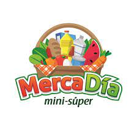
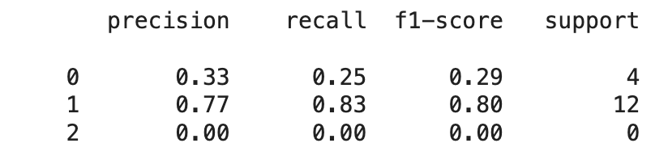
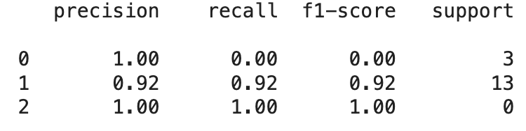
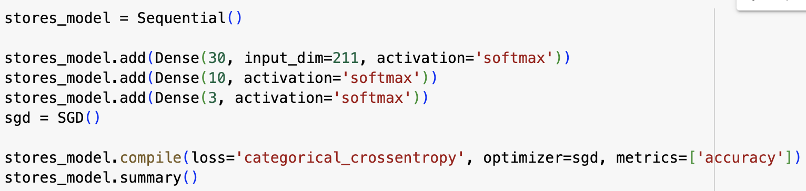
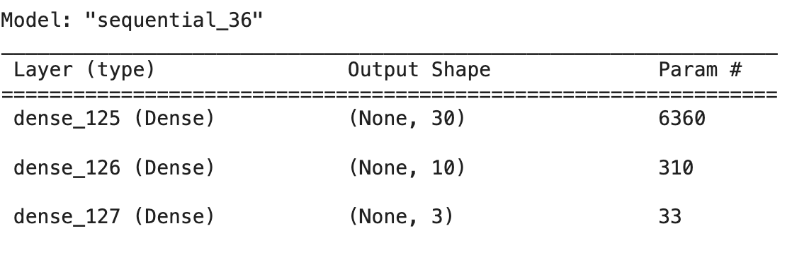
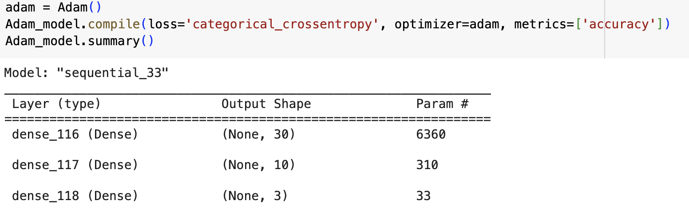
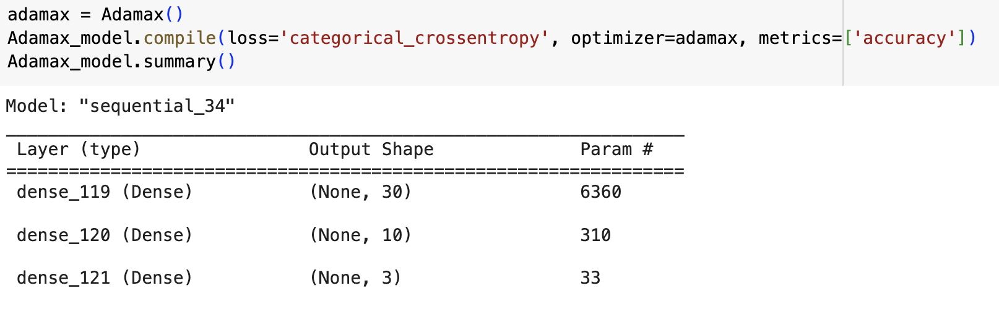
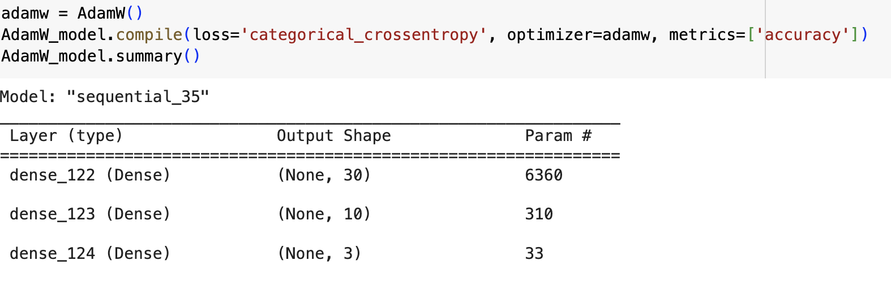
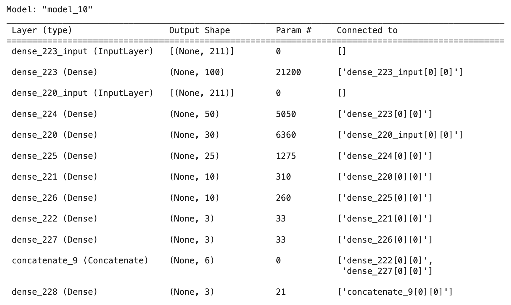

# RETAIL PERFORMANCE PREDICTION MODEL: Mercadia

# What is Mercadia?
Mercadia is a groceries chain store brand, owned by 7-Eleven Mexico which offers a supermarket experience at a lower price.
The brand targets pedestrian heavy zones in residential areas
It operates in a highly competitive market with brands such as OXXO, Bodega Aurrera Express, 7-eleven, etc.
As it looks to expand it also looks to minimize risk by putting stores in high potential locations.

# Our Dataset
The dataset we obtained contains all the attributes considered factors that impact the performance of the stores, such as:
* Socio-economic level: The socioeconomic level of the AGEB of interest
* Crossing location (far or short corner): Within a crossing, which corner does the store stands on.
* Competitors in the area: Presence of competitors in close proximity segmented by 300m and 500m 
* Trade generators: Presence of trade generators like hospitals, schools, religious centers, etc.

# Data Visualization
Please a look at our dashboard on Tableau public in which we explore the most important feuatures of the dataset, such as the name generator, the number of stores per target and the socioeconomic level.

The dashboard can be find in the following link: https://public.tableau.com/app/profile/miguel.vargas1996/viz/Project4-RetailPredictionModel/MecaDaDashboard

# Project Objective:
Our goal was to create a model that accurately predicts the performance of a new store given we have the attributes of the location. The performance is categorized in the following brackets.
* Top: The stores with highest EBIT 
* Mid: The stores with close to the average EBIT
* Bottom: The stores with close to the lowest EBIT
NOTE: EBIT means "Earnings Before Interest and Taxes"

# Our Machine Learning Model

* KNeighbors Classifier
The first model we tried building was the KNeighbors Classifier. This model returned very unpromising results, with an accuracy of only 68%, therefore we opted to use a different model. The classification report for this model can be seen below.

* Random Forest
This time our results were much more promising, having an accuracy of 75% and a classification report that was better than the Kneighbors.

# Optimization of the Machine Learning Model
# Neural Networks

* SDG
For our final attempt before optimizing the models we decided to try a Neural Network, our first attempt consisted of one layer with the softmax activation and the SDG optimizer. 
While the accuracy wasn’t the worst, this is when we realized we might have a problem regarding the loss value. In order to reduce the loss value we tried adding layers and changing the activation from softmax to relu on the hidden layers. However, this resulted in a significant increase on the loss value.

Instead, after several attempts we got the best results when having a total of 3 layers, all of them with the “softmax” activation, a shape of 30,10 and 3 outputs as well as 200 epochs, with this squema we managed to increase the accuracy to 81% and decrease the loss to 0.60.

After this we decided to try different optimizers such as the Adam, Adamax and AdamW.

* Adam

Accuracy: 81%, loss: 0.61

* Adamax

Accuracy: 81%, loss: 0.67

* AdamW

Accuracy: 81%, loss: 0.64

None of the optimizers provided enhanced values for accuracy nor loss.

# Stacking Neural Networks
Since none of the optimizers helped us to reduce the lose value we decided to stack 2 and 3 different neural networks to enhance the results.

We concatinated and compiled them into one final layer that had 3 outputs (our targets). 

When comparing, the squema with 2 neuralnetworks outclassed by far the one with 3 in both accuracy and loss. The squema with 2 stacked Neural Networks is shown below

The two models were compiled in one final layer with three outputs, using the Adam optimizer, the softmax activation was used on every layer.

Results:
* Accuracy: 81%
* Loss: 0.57

In addition to changing the layers, activations and optimizers we also tried to enhance the results by scaling the data and using PCA, however, when scaling our accuracy decreased significanlty and when using the PCA to redue the number of columns it came at the cost of increasing the model loss.

# Conclusions
* Big data: The dataset was too small for any model to make an accurate prediction and avoid overfitting the data.
* Improving results: Although the data is not the best, the different approaches serve to show that it can achieve decent results, optimizing both the models and the data
* Stacked Neural Networks: The stacked neural network model returned the best results across all models

NOTE: All of the files for this project can be found on the "Project_4" folder. This repository contains 2 Jupyter Notebooks, it was necessary to use both in order to showcase all of the data cleaning process while avoiding displaying or sharing any kind of sensitive data. 
